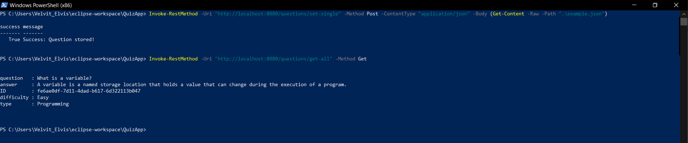
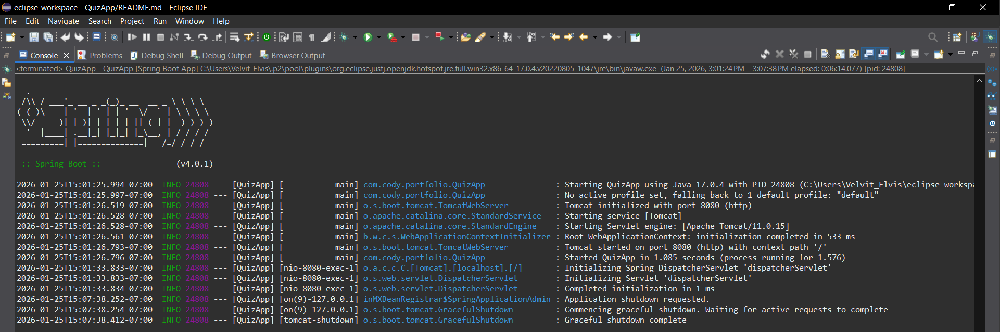

# QuizApp "IS"

QuizApp is a Spring Boot Quiz service that exposes a REST API for managing quiz questions. 
It organized as controller-service-domain and uses explicit, verb-noun patttern endpoints.
The domain centers around Question objects, which has type, difficulty, prompt, answer, and a generated UUID (on instantiation).
The project is intentionally lightweight and serves as an example of idiomatic Java and simple Spring Boot design.

#QuizApp "IS NOT"

It is not a framework or a reusable library.
Its purpose is to demonstrate backend development skills.
QuizApp is not a full quiz-taking platform, UI, or production-ready question bank.
It is an academic and portfolio-focused project designed to showcase Spring Boot fundamentals and clean Java design.

## System Design Diagrams

<details>
<summary>File Structure</summary>

src/main/java/com.cody.portfolio/
│
├── QuizApp                           # Main
│
├── controller/
│   ├──QuestionController             # Provides explicit endpoints for creating, retrieving, and deleting Questions.
│   └── dto/
│       └── ApiResponse               # A simple DTO to add context to service data.
│
├── domain/
│   └── Question                      # Represents a single quiz question within the domain.
│
├── service/
│   └── QuestionService               # An array backed service responsible for managing a collection of Question objects.
│   └── sorting/
│       ├── AbstractSortingStrategy   # The base class for sorting strategies used to sort an array of Questions objects.
│       ├── InsertionSortStrategy     # A concrete sorting strategy that performs in-place insertion sort on an array of Question objects. 
│       ├── QuestionTypeComparator    # A Comparator for ordering Question objects by their Type field.
│       └── SortingStrategy           # A funtional interface that defines the contract for sorting an array of Question objects.
└── utility/
    └── ArrayUtility                  # A generic utility class for performing array transformations.

</details>

## Basic Use of the System

<details>
<summary>End point variations</summary>

```powershell
"http://localhost:8080/questions/<end-point>" 

<endpoints> = {
get-single/<UUID>,
get-many/<Type>,
get-all,
delete-single/<UUID>
}
 ```
</details>

<details>
<summary>Powershell example using the example.json</summary>


```powershell
Invoke-RestMethod ` 
-Uri "http://localhost:8080/questions/set-single" ` 
-Method POST ` 
-ContentType "application/json" ` 
-Body (Get-Content -Raw -Path ".\assets\example.json")
```

Example success:

```json
{
	"success":"True",
	"message":"Success: Question stored!"
}
```

Example failure:

```json
{
	"success":"False",
	"message":"Failed: The question array is full!"
}
```

Example invalid:

```json
{
	"success":"False",
	"message":"The parameter question must have non-null, non-blank text!" 
	OR
	"message":"The parameter answer must have non-null, non-blank text!" 
}

```

</details>


## Extending the System
QuizApp includes a pluggable sorting subsystem built around sorting/AbstractSortingStrategy.
You can extend the system by implementing your own sorting algorithm and (optional) your own
comparator.

<details>
<summary>Comparator</summary>
A sorting strategy requires a Comparator<Question> to define the ordering.
You can either:
- Reuse the comparator in this service (QuestionTypeComparator)
- Create a new comparator by implementing Comparator<T>

```java
public class DifficultyComparator implements Comparator<Question> {
    @Override
    public int compare(Question a, Question b) {
        return a.getDifficulty().compareTo(b.getDifficulty());
    }
}

```
</details>

To add a new sorting algorithm, create a class that extends sorting/AbstractSortingStrategy

<details>
<summary>SortStrategy</summary>

```java
public class SomeCustomSortStrategy extends AbstractSortingStrategy {

    public SomeCustomSortStrategy(Comparator<Question> comparator) {
        super(comparator);
    }

    @Override
    public void sort(Question[] questions) {
        // binary, selection, etc...
        // to compare: comesBefore(a, b) to compare elements
    }
}

```
</details>
 

## Dependencies

- **Spring Boot** (4.x)
- **Java** (17.x)

## System Demonstration

<details>
<summary>API response</summary>


</details>

<details>
<summary>Service</summary>


</details>

